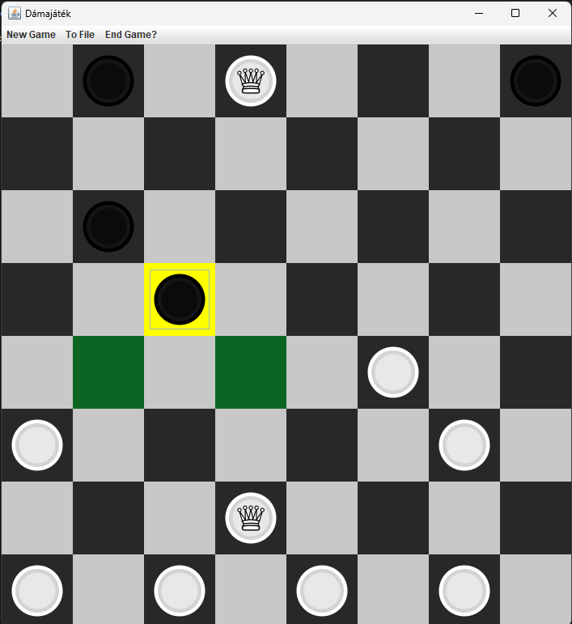

# Java Checkers Game

This is a **Checkers game** implemented in **Java** as a final assignment for the *Programming Basics 3* course.

## Features
- Playable on an **8x8 board**  
- Two game modes:  
  1. **Two-player mode** – play against another person  
  2. **Single-player mode** – play against a simple AI (robot player)  
- Enforces **all standard rules** of checkers, including valid moves and captures
- Save game and load game functions

## Technologies
- **Language:** Java  
- **GUI:** Swing

##  Demo


## Installation & Running
1. Clone the repository:
```bash
git clone https://github.com/zelchcsaba/Harmadik_nagyhazi_Damajatek.git
cd Harmadik_nagyhazi_Damajatek
```
2. Open the run.bat file.
